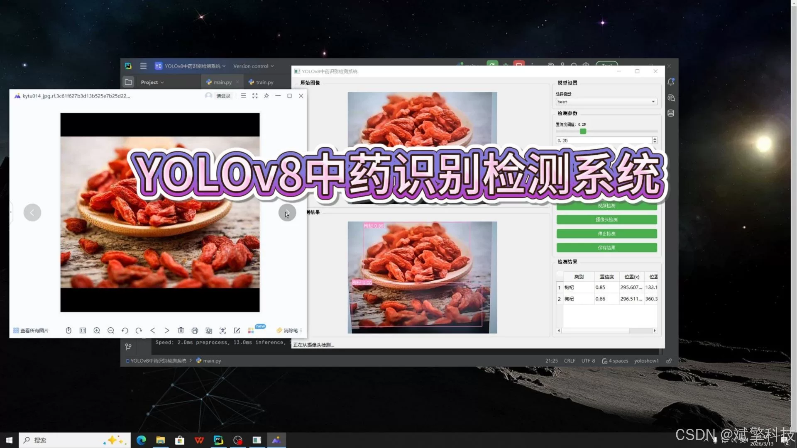
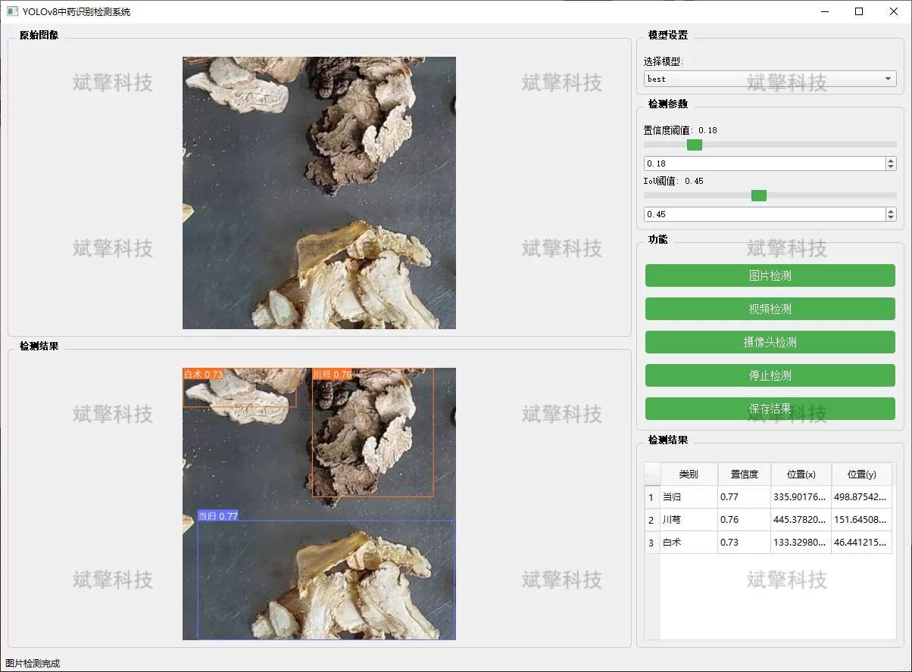
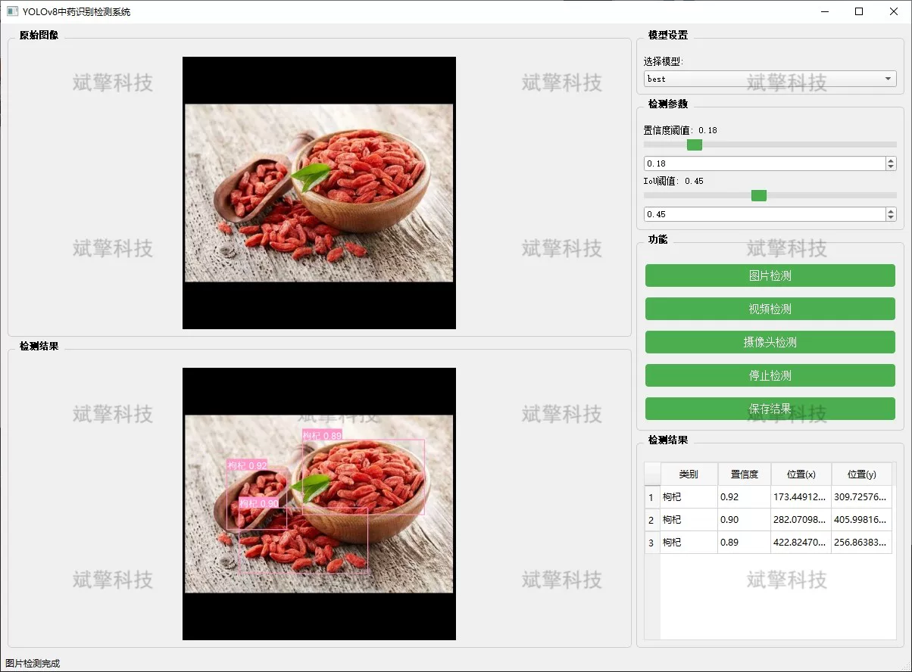
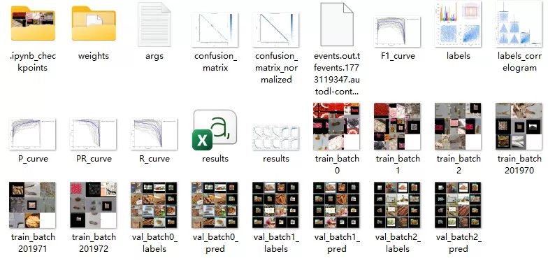
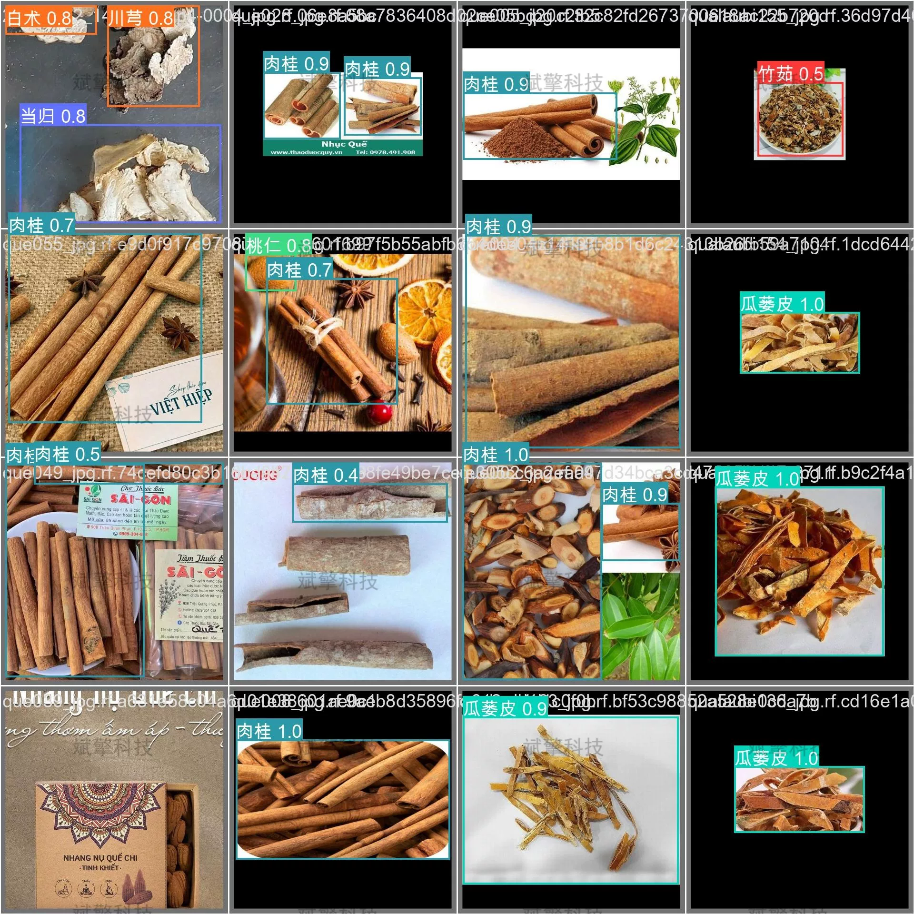

# YOLOv8-based Traditional Chinese Medicine Identification System

## Body

YOLOv8 Traditional Chinese Medicine Identification System Based on YOLOv8 Deep Learning

This project is based on the YOLOv8 deep learning framework and has developed a visible light image intelligent recognition system for traditional Chinese medicine. The system targets 45 common traditional Chinese medicines (including Poria cocos, Paeonia lactiflora, Atractylodes macrocephala, Dandelion, Licorice, etc.) for target detection and recognition. It can quickly and accurately identify and locate traditional Chinese medicines from images, videos, and real-time camera streams. The system adopts the advanced YOLOv8 target detection algorithm, combined with a self-built dataset of over 10,000 high-quality images of traditional Chinese medicines, to achieve precise learning and recognition of the external features of traditional Chinese medicines. This system can be widely applied in fields such as monitoring of medicinal materials in traditional Chinese medicine planting bases, quality control in traditional Chinese medicine decoction factories, verification of medicinal materials in pharmacies, and traditional Chinese medicine teaching training, providing strong technical support for the digital and intelligent development of the traditional Chinese medicine industry.

System Features

✅ Image Detection: Can detect images and return detection boxes and category information.

✅ Video Detection: Support video file input, detecting each frame in the video.

✅ Real-time Camera Detection: Connect USB camera to achieve real-time monitoring.

✅ Parameter Real-Time Adjustment (Confidence and IoU Thresholds)

Dataset Overview

Training set allocation: 8,500 images, used for model learning;
Validation set allocation: 1,500 images, used for evaluating model performance.

## Images

## Payment

Here is a pay link on Stripe ( https://buy.stripe.com/3cs8yP7sY87d0vu9AB ). Please contact me lonlonago@foxmail.com after funding $89, and I will send you a complete data files , thank you!

